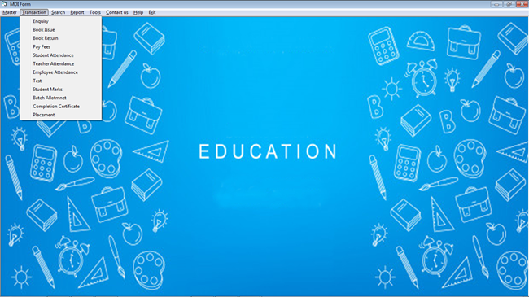

## OBJECTIVE AND SCOPE OF THE PROJECT

INSTITUTE MANAGEMENT SYSTEM is capable of managing all the data related to the institute. It is fully functional software that helps in managing the data related to all tasks of an institute.

This INSTITUTE MANAGEMENT SYSTEM is very beneficial in estimating the real position of the system. It has the following activities:

1. Less paperwork
All the work used to be done on papers but now it can be eliminated & managed on computer that will increase the efficiency of the system. It also helps in searching any data reliably and very fast.

2. Better presentation
All the reports generated in INSTITUTE MANAGEMENT SYSTEM have the capability of better presentation than manual. We can also modify the presentation according to our requirement.

3. Reduction in consumption of time
The time consumed in duplicating the Reports or list can be reduced much extent by using INSTITUTE MANAGEMENT SYSTEM. A new requirement can also be obtained in very less time.

4. Easy to implement
This system can be implemented in an institute very easily & easy to understand. A user can work on this system by taking a small training very easily.

 
## THEORETICAL BACKGROUND

In earlier days, the INSTITUTE MANAGEMENT SYSTEM was working manually, therefore all the processing is to be done by the human beings, therefore the record has to be stored in files, which is very time consuming. Also storing and retrieving records on file is very difficult to maintain, because somehow we lost information in files and if we required it then we get helpless to find them. A big amount is spent in making and maintenance of data and any kind of worms can destroy the files.

Earlier when the number of student is less, it’s not that difficult to maintain the records. But now in institute, the number of student has grown larger and due to this, large quantity of stationary is used. The maintenance and searching the records become very time consuming and tedious.

Now they want to make it computerized to make it cost effective by saving the lots of time, space and by reducing the stationary used.
 
## PROBLEM DEFINITION

There are many problems with the current system like:

1. Time consuming
2. Wastage of paper
3. Difficult to search records
4. Difficult to add/edit records 

### Time Consuming

Adding multiple records take a lot of time. Records may be of students and staff member then we have to create a separate register for that. And if we want to search the record, then we have to search all the registers through it. Not only this decreases the reliability of systems but also generates a feeling of uneasiness. It can create a lot of confusion, suppose the handler of the record is not present then all the work could be stopped for that day, which would result in the delay of future work. So we have to waste our time by searching this long procedure, but in this software we don’t have to search it in registers, we can get all the details of the record, just knowing the ID of that record. Next if one record is lost then, making a new record would be a lot of time consuming. 

### Wastage of Paper

Many resisters are maintained and multiple records are created which lead to the wastage of paper. First of all the records are created then a registers is maintained for correspondents containing their details e.g. Name, Address, and Phone no etc. 

### Difficult to Search Records

It is difficult to extract information from paper records quickly and efficiently, in case of misplace of register, or fail to get it which not only slows the speed to process the records, also increases cost of institute. This costs institute both time and money.

### Difficult to add/edit records 

If you want to make changes to a paper-based document, you will need to photocopy the original first - otherwise you will ruin it with edits and comments. This will need to be repeated every time you want to make more amendments and you may end up running out of space if significant alterations are required. Ultimately, editing becomes a messy and time-consuming process that could leave the original document in a sorry state. 
 
 

 
## HARDWARE AND SOFTWARE REQUIREMENTS

### Hardware Requirements
			
	Machine compatible		:	 Pentium IV onwards
	Processor			: 	2.40GHZ
	Main memory			: 	1 GB onwards
	Hard disk space			: 	10 GB at least
	Keyboard			: 	108 Key Standard  Keyboard
	Mouse				: 	Optical/Laser
	Printer				: 	Inkjet/Laser

### Software Requirements

	Operating system		:	Windows 2000/2003/XP/2007
	Languages used			:	VISUAL BASIC 6.0
	Database Package		:	Microsoft-Access
	Others				:	360 security Antivirus

## output screen 

 

 
